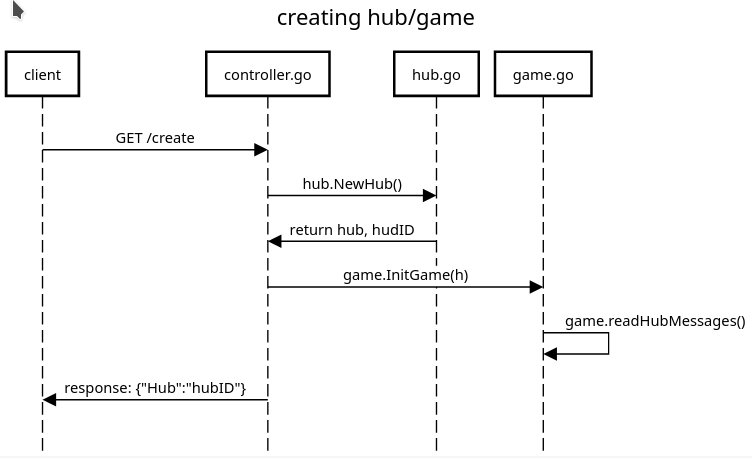
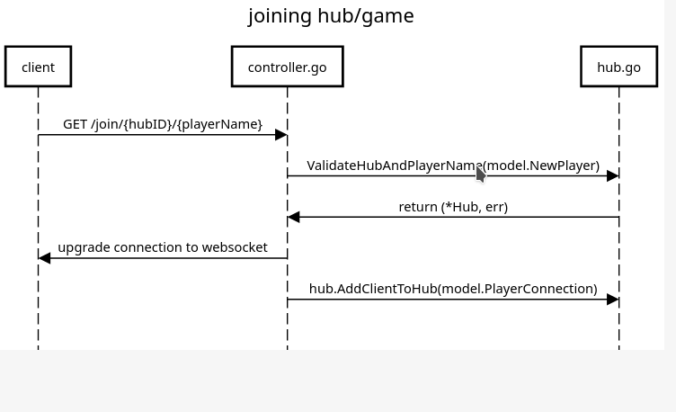

# Explanation
Website used for sequence diagrams: https://sequencediagram.org/

## Creating hub


Sequence diagram code: <br>
```
title creating hub/game
client -> controller.go : GET /create
controller.go -> hub.go: hub.NewHub()
controller.go <-hub.go:return hub, hudID
controller.go -> game.go: game.InitGame(h)
game.go ->game.go: game.readHubMessages()
controller.go ->client: response: {"Hub":"hubID"}
```

## Joining hub

Sequence diagram code: <br>
```
title joining hub/game
client -> controller.go : GET /join/{hubID}/{playerName}
controller.go -> hub.go: ValidateHubAndPlayerName(model.NewPlayer)
hub.go ->controller.go: return (*Hub, err)
controller.go ->client: upgrade connection to websocket
controller.go -> hub.go: hub.AddClientToHub(model.PlayerConnection)
```

