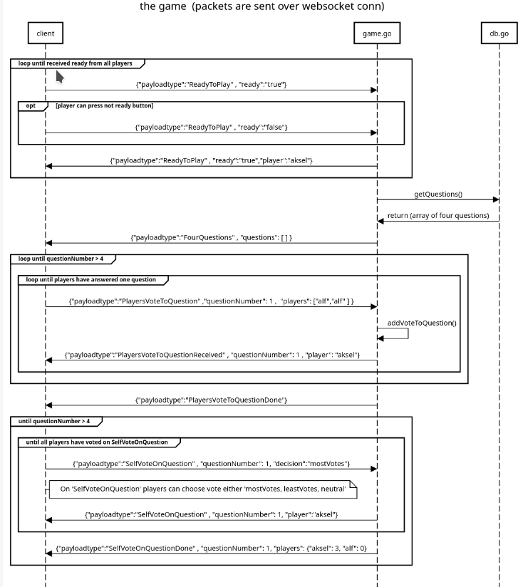

# Explanation
Website used for sequence diagrams: https://sequencediagram.org/

## Creating hub


Sequence diagram code: <br>
```
title creating hub/game
client -> controller.go : GET /create
controller.go -> hub.go: hub.NewHub()
controller.go <-hub.go:return hub, hudID
controller.go -> game.go: game.InitGame(h)
game.go ->game.go: game.readHubMessages()
controller.go ->client: response: {"Hub":"hubID"}
```

## Joining hub

Sequence diagram code: <br>
```
title joining hub/game
client -> controller.go : GET /join/{hubID}/{playerName}
controller.go -> hub.go: ValidateHubAndPlayerName(model.NewPlayer)
hub.go ->controller.go: return (*Hub, err)
controller.go ->client: upgrade connection to websocket
controller.go -> hub.go: hub.AddClientToHub(model.PlayerConnection)
```

## Playing the game

Sequence diagram code: <br>
```
title the game  (packets are sent over websocket conn)

group loop until received ready from all players
client -> game.go: {"payloadtype":"ReadyToPlay" , "ready":"true"}

opt player can press not ready button
client -> game.go: {"payloadtype":"ReadyToPlay" , "ready":"false"}
end

game.go ->client: {"payloadtype":"ReadyToPlay" , "ready":"true"}

end

game.go -> db.go: getQuestions()
db.go ->game.go: return (array of four questions)

game.go ->client: {"payloadtype":"FourQuestions" , "questions": [ ] }

group loop until questionNumber > 4
group loop until players have answered one question

client -> game.go: {"payloadtype":"AnswerToQuestion" , "players": ["aksel","alf" ] }

game.go ->game.go: addVoteToQuestion()
game.go ->client:  {"payloadtype":"ReceivedAnswerToQuestion" , "questionNumber": 1 , "player": "aksel"}
end
game.go ->client:  {"payloadtype":"NextQuestion" , "nextQuestionNumber": 2}
end
end

game.go -> client:{"payloadtype":"VotesToQuestions" , "votesToQuestions": [ "question: 1, votes: { "aksel": 2, "alf" : 3 } ] }

group until questionNumber > 4
group until all players have voted on SelfVoteOnQuestion
client->game.go: {"payloadtype":"SelfVoteOnQuestion" , "question": 1, "decision":"mostVotes"}
note right of client: On 'SelfVoteOnQuestion' players can choose vote either 'mostVotes, leastVotes, neutral'
game.go ->client: {"payloadtype":"SelfVoteOnQuestion" , "question": 1, "player":"aksel"}
end
game.go ->client: {"payloadtype":"SelfVoteOnQuestionDone" , "question": 1, "players": {"aksel":"mostVotes", "alf":"leastVotes" } }
end 

```